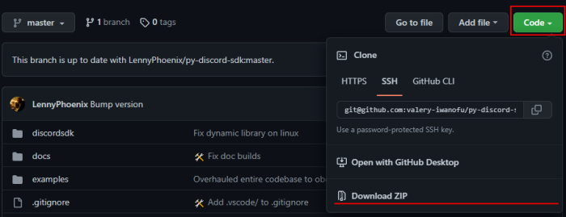

# Discord Game SDK for Python

A Python wrapper around Discord's Game SDK.

**NOTE**: This is entirely experimental, and may not work as intended. Please report all bugs to the [GitHub issue tracker](https://github.com/LennyPhoenix/py-discord-sdk/issues).

**Credit to [NathaanTFM](https://github.com/NathaanTFM) for creating the [original library](https://github.com/NathaanTFM/discord-game-sdk-python) and [LennyPhoenix](https://github.com/LennyPhoenix) for upgrading old project.**

## Installation

- Install the module:
  - With `PIP`:
    - Latest: `python -m pip install --target /project_root/game git+https://github.com/valery-iwanofu/py-discord-sdk.git`
  - With `setup.py`:
    - `git clone https://github.com/valery-iwanofu/py-discord-sdk.git`
    - `cd py-discord-sdk`
    - `python -m setup install --target /project_root/game .`
  - Direct download:
    - Download this repository as archive by clicking on "Download ZIP" in "Code" menu
    - Grab the `discordsdk` folder from downloaded archive and put it in your project's game directory.
    
- Download [Discord Game SDK (2.5.6)](https://dl-game-sdk.discordapp.net/2.5.6/discord_game_sdk.zip).
- Grab the DLL from `discord_game_sdk.zip` in the `lib` directory and put it in your project's root directory.

## Integrate
1. Import `discordsdk` module
2. Initialize sdk library using `discordsdk.sdk.init_sdk(basedir)`
3. Create `Discord` instance and store it somewhere
4. Run periodic callbacks of `Discord` instance somewhere(generally, it can be done in `config.periodic_callbacks`)
```python
import discordsdk as dsdk

dsdk.sdk.init_sdk(config.basedir)

discord = dsdk.Discord(APPLICATION_ID, dsdk.CreateFlags.default)

def __discord_periodic_callback():
    discord.run_callbacks()

config.periodic_callbacks.append(__discord_periodic_callback)
```

## Documentation

If you need documentation, look at [**the official Game SDK docs**](https://discord.com/developers/docs/game-sdk/sdk-starter-guide); this was made following the official documentation.
We also have some [work-in-progress wiki docs](https://github.com/LennyPhoenix/py-discord-sdk/wiki).

## Features

- Should be working:
  - **ActivityManager**
  - **ImageManager**
  - **NetworkManager**
  - **RelationshipManager**
  - **StorageManager**
  - **UserManager**

- Should be working, but need more testing:
  - **AchievementManager** (not tested at all)
  - **ApplicationManager** (especially the functions `GetTicket` and `ValidateOrExit`)
  - **LobbyManager**
  - **OverlayManager**
  - **StoreManager** (not tested at all)
  - **VoiceManager**

## Contributing

The code needs **more comments, type hinting**. You can also implement the **missing features**, or add **more tests**. Feel free to open a **pull request**!

You can also **report issues**. Just open an issue and I will look into it!

### Todo List

- Better organisation of submodules.
- CI/CD.
- Update sdk.py to use type annotations.
- Update to Discord SDK 3.2.0.

## Examples

You can find more examples in the `examples/` directory.

### Get current user

```python
discord = # see how to create discord instance above

user_manager = discord.get_user_manager()


def on_curr_user_update():
    user = user_manager.get_current_user()
    print(f"Current user : {user.username}#{user.discriminator}")


user_manager.on_current_user_update = on_curr_user_update
```

### Set activity

```python
discord = # see how to create discord instance above

activity_manager = discord.get_activity_manager()

activity = dsdk.Activity()
activity.state = "Testing Game SDK"
activity.party.id = "my_super_party_id"
activity.party.size.current_size = 4
activity.party.size.max_size = 8
activity.secrets.join = "my_super_secret"


def callback(result):
    if result == dsdk.Result.ok:
        print("Successfully set the activity!")
    else:
        raise Exception(result)


activity_manager.update_activity(activity, callback)
```
